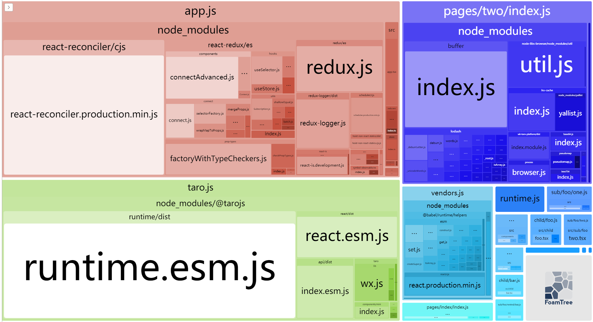

# taro-plugin-webpack-analyze

支持 webpack 打包分析

## Usage

```shell
$ yarn add taro-plugin-webpack-analyze -D # or npm i taro-plugin-webpack-analyze --save-dev
```

<br/>

配置

```js
const config = {
  // ...
  plugins: ['taro-plugin-webpack-analyze'],
};
```

<br/>

开启分析模式：

```shell
# windows
$ yarn cross-env ANALYZE=true yarn build:weapp

# *unix
$ ANALYZE=true yarn build:weapp
```

<br/>

运行截图：

